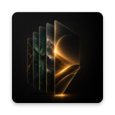
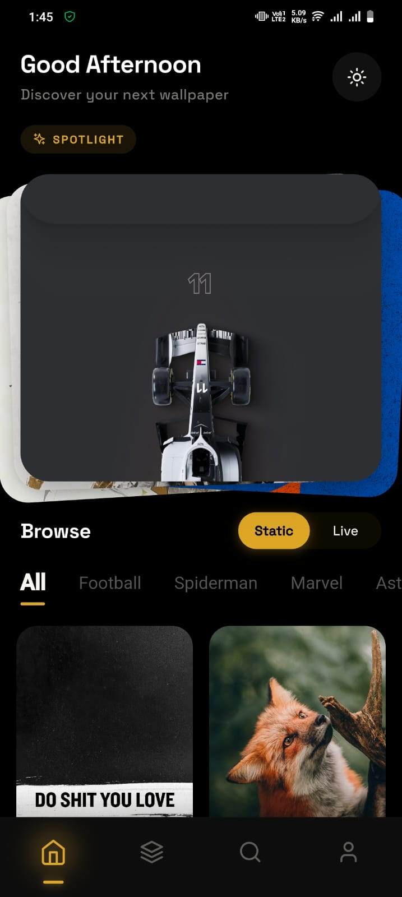
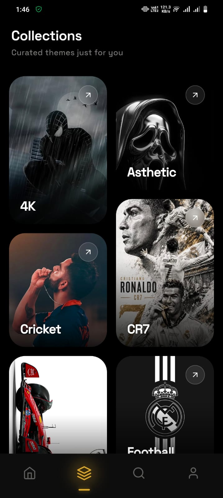
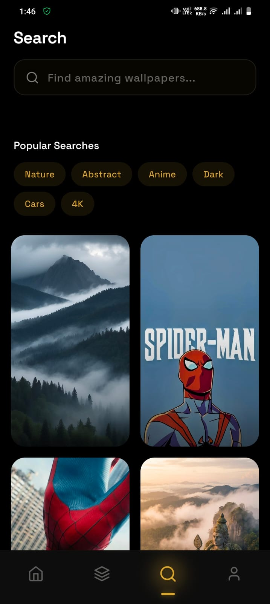
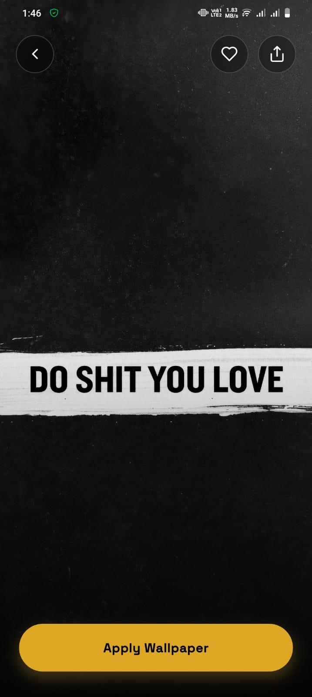
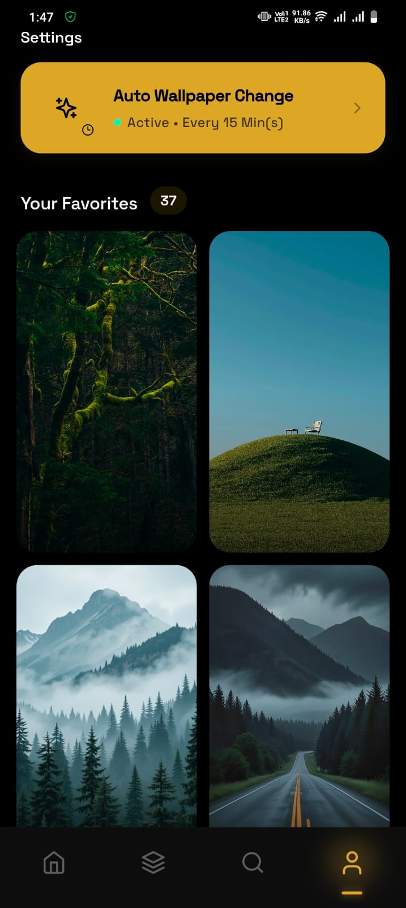

# Prysm

### Premium Wallpapers. Minimal Design. Beautiful Experience.

  
  
  
  

**A beautifully crafted wallpaper experience, built with Flutter.**

[Download APK](../../releases/latest) · [Report a Bug](../../issues/new) · [Request a Feature](../../issues/new)

⭐ **If you enjoy Prysm, consider starring the repository — it really helps!**

---

## ✨ About

**Prysm** is a modern wallpaper application focused on delivering a premium user experience through elegant design, smooth animations, and carefully curated wallpapers.

Built with Flutter, Prysm emphasizes simplicity, speed, and attention to detail — offering a fast, delightful browsing experience across Android devices.

This repository is the official home for APK releases, changelogs, issue tracking, and community discussion.

---

## 🚀 Features

| | |
|---|---|
| 🖼️ **Premium 4K Wallpapers** | Curated high-resolution wallpapers, crafted for stunning detail |
| 🎬 **Live Wallpapers** | Bring your home screen to life with dynamic, animated backgrounds |
| 🔄 **Auto Change Wallpapers** | Automatically refresh your wallpaper on your own schedule |
| 🎨 **Premium UI & UX** | Clean, elegant interface designed with attention to detail |
| ⚡ **Smooth Animations** | Fluid transitions throughout the entire app |
| 🗂️ **Beautiful Collections** | Thoughtfully curated wallpaper sets |
| ❤️ **Favorites** | Save and revisit the wallpapers you love |
| 🔍 **Fast Search** | Find the perfect wallpaper in seconds |
| 🔎 **Full Screen Preview** | Preview wallpapers before applying |
| ⬇️ **One-Tap Download** | Save wallpapers directly to your device |
| 🌙 **Dark Theme** | Easy on the eyes, day or night |
| 📶 **Offline Cache** | Browse previously loaded wallpapers without an internet connection |
| 🪶 **Lightweight & Fast** | Minimal footprint, maximum performance |
| 🔁 **Regular Updates** | New wallpapers and features added continuously |

---

## 📸 Screenshots

  
  
  
  
  

---

## 📥 Download

Grab the latest APK directly from the **[Releases](../../releases/latest)** section.

> No Play Store account required — just download and install.

---

## 🤔 Why GitHub?

Prysm is distributed through GitHub Releases, which enables:

- ⚡ Faster updates
- 📜 Transparent release history
- 💬 Direct community feedback
- 🐛 Easy bug reporting
- 💡 Feature requests from real users
- 🔓 Independent, unrestricted distribution

---

## 🗺️ Roadmap

- [ ] Material You dynamic theming
- [ ] Tablet support
- [ ] Search improvements
- [ ] AI-powered recommendations
- [ ] Expanded wallpaper collections
- [ ] Cloud sync
- [ ] AMOLED (true black) mode
- [ ] Daily wallpaper suggestions

---

## 🐞 Report a Bug

Found an issue? Please [open a GitHub Issue](../../issues/new) and include:

- Device model
- Android version
- App version
- Steps to reproduce

The more detail you provide, the faster it can be fixed. 🙏

---

## 💖 Support Development

Prysm is independently developed and maintained by a solo developer.

If you enjoy the project and want to support its future, consider contributing via **[Open Collective](#)**.

Your support helps fund:

- 🧑‍💻 Development
- 🖥️ Infrastructure
- 🎨 Design resources
- 📱 Testing devices
- 🚀 Future features

Every contribution, big or small, is genuinely appreciated. ❤️

---

## ©️ Copyright

The Prysm application, branding, design, and source code are proprietary.

Wallpaper copyrights belong to their respective owners unless otherwise stated. If you are a copyright owner and would like content removed, please [contact me](../../issues/new) and I will address your request promptly.

---

## 📄 License

This repository contains release assets and documentation only.

The application source code is **private** and **not licensed for redistribution**. Unauthorized copying, modification, or redistribution of the application or its assets is strictly prohibited.

---

Made with ❤️ by **Pawan Bhandary**

If you enjoy Prysm, ⭐ star this repository — it means a lot!

